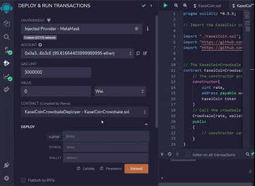
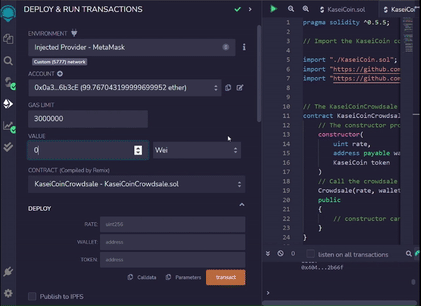
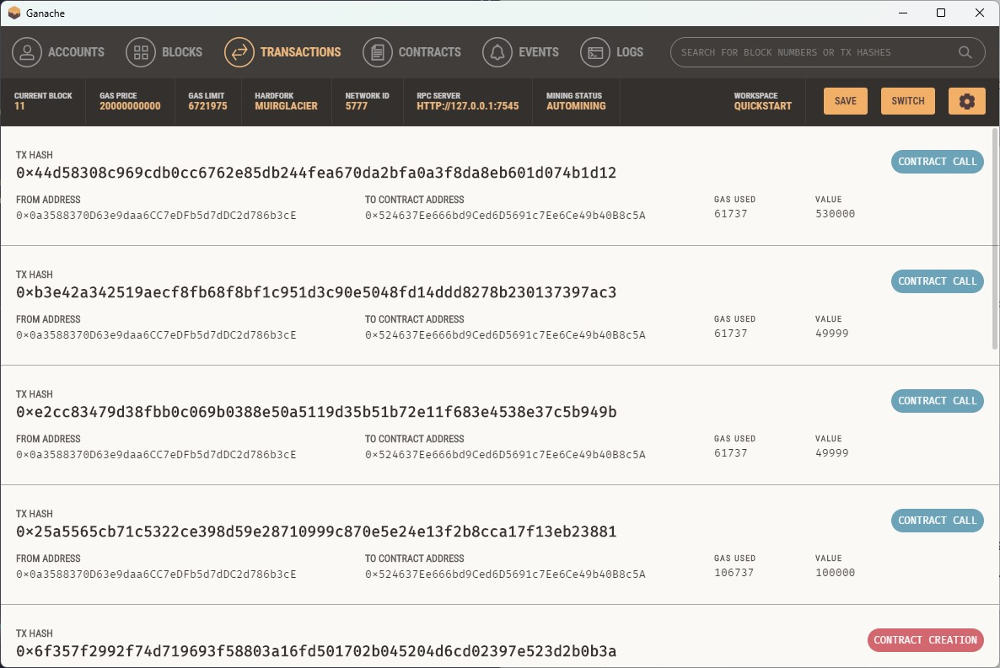

# Fungible Token Crowdsale

This project is a set of three ERC-20 compliant smart contracts that manage the creation and distribution of a fungible token called KaseiCoin, or "Mars" coin. The token is meant to represent a blockchain currency that would be used by residents of a fictional Mars colony.

## Contract Functionality

The three contracts used in this project are called KaseiCoin, KaseiCoinCrowdsale, and KaseiCoinCrowdsaleDeployer. All of the contracts inherit functionality from OpenZeppelin.

The KaseiCoin contract inherits functionality from ERC20, ERC20Detailed, and ERC20Mintable. It contains a constructor which creates the name, symbol, and initial supply of the token, and calls the ERC20Detailed constructor which takes the name and symbol parameters as well as the decimal value for the token. I chose 18 as a decimal value as that is the value for wei.

```solidity
contract KaseiCoin is ERC20, ERC20Detailed, ERC20Mintable {
    constructor(
        string memory name,
        string  memory symbol,
        uint initial_supply
    )
    ERC20Detailed(name, symbol, 18)
    public
    {
        //constructor stays empty. mint functionality is controlled by the crowdsale contract
    }
}
```
The KaseiCoinCrowsdale contract inherits functionality fromn Crowdsale and Minted Crowdsale. It contains a constructor which establishes the rate for the token, address to receive the proceeds from the crowdsale, and the token itself. It then calls the Crowdsale constructor with the same parameters.

```solidity
contract KaseiCoinCrowdsale is Crowdsale, MintedCrowdsale {
    constructor(
        uint rate,
        address payable wallet,
        KaseiCoin token
    )
    Crowdsale(rate, wallet, token) 
    public
    {
        // constructor can stay empty
    }
}
```

The KaseiCoinCrowdsaleDeployer contract deploys the other two contracts and assigns addresses to them. It also assigns the minter role to the KaseiCoinCrowdsale contract and renounces its own minter role. We deploy this contract first, then deploy the other two contracts at the addresses to which they were assigned. 

```solidity
contract KaseiCoinCrowdsaleDeployer {
    
    address public kaseiTokenAddress;
    address public kaseiCrowdsaleAddress;

    constructor(
       string memory name,
       string memory symbol,
       address payable wallet
    )
    public
    {
        KaseiCoin token = new KaseiCoin(name, symbol, 0);
        kaseiTokenAddress = address(token);

        KaseiCoinCrowdsale kaseiCrowdsale = new KaseiCoinCrowdsale(1, wallet, token);
        kaseiCrowdsaleAddress = address(kaseiCrowdsale);

        token.addMinter(kaseiCrowdsaleAddress);
        
        token.renounceMinter();
    }
}
```

## Demonstration

Before deploying the contracts, I compiled them with the 0.5.17 Solidity compiler. Images showing the successful compilation of the contracts can be found in the images folder of the repository.

To test the contracts, I used the Remix IDE, Ganache test network, and Web3 provider Metamask. I loaded 2 test accounts from Ganache into MetaMask and linked them to Remix. I set one of my accounts as the crowdsale investor and the other as the beneficiary and deployed the contract, as shown here. Note that when recording my screen, I wasn't able to capture the MetaMask popup where I confirmed the transaction.



After deploying the contract, I ran some transactions using my test accounts. For the sake of simplicity, I set up the contract so that 1 token = 1 wei. In the following gif, you can see that after making the transaction, the weiRaised amount increases.



A record of the transactions can also be found under the Transactions tab in Ganache.




## Technologies

* Solidity
* Remix IDE
* Ganache Ethereum Blockchain
* MetaMask Web3 Provider

## Contributors

Lydia Ciummo

## License

GNU General Public License v3.0